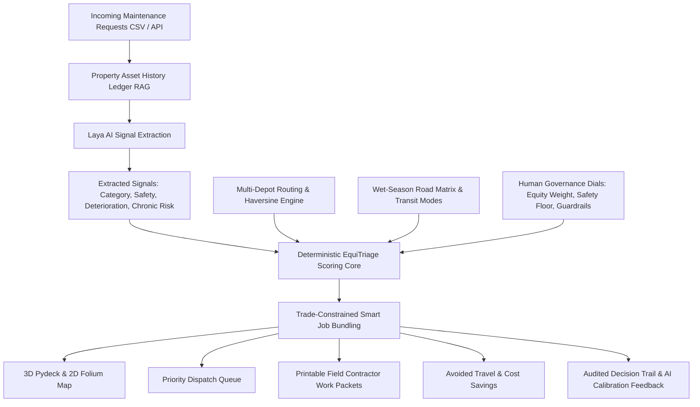

# 🏛️ EquiTriage // Executive Briefing & System Whitepaper
**Autonomous Decision-Support & Spatial Logistics Engine for Public Housing in the Northern Territory**

---

## 1. Executive Summary

Public housing maintenance in the Northern Territory (NT) is one of the most operationally challenging logistics environments on earth:
- **1.35 million square kilometers** of territory.
- **Extreme isolation**: Remote First Nations communities sit 400 km to 1,500 km from central depots.
- **Severe weather disruptions**: Monsoonal wet-season flooding (November–April) cuts unsealed highways and isolates river crossings (e.g. Cahills Crossing into West Arnhem, Daly River causeways).
- **The "Efficiency Trap"**: Traditional dispatch software—and naive AI schedulers—optimize strictly for lowest contractor travel cost or immediate urban ticket volume. In practice, this quietly locks out remote communities: urban Darwin requests are repeatedly answered in 48 hours, while remote residents wait 60 to 120+ days for basic plumbing and power repairs.

**EquiTriage** solves this crisis. It bridges modern AI signal extraction with deterministic spatial logistics and human governance:
1. **Zero-shot signal extraction with Laya AI**: Evaluates tenant distress text, categorizes trade requirements, flags imminent safety hazards, and rates property deterioration without hallucinating rankings.
2. **Context-Aware Property RAG**: Queries historical address maintenance ledgers to detect chronic recurring asset breakdowns before they turn catastrophic.
3. **Multi-Depot Regional Hubs**: Dispatches dynamically across Darwin, Katherine, Tennant Creek, Alice Springs, and Nhulunbuy.
4. **Wet-Season Passability Matrix**: Monitors river cutoffs and switches transit automatically to 4WD heavy convoy, sea barge, or light aircraft charter.
5. **Smart Trade-Constrained Job Bundling**: Mathematically proves that dispatching a crew to a remote community and resolving all compatible overdue jobs on that visit recovers thousands of kilometers in avoided future travel—**making fairness cheaper than neglect.**

---

## 2. Core Architectural Principles



### The Separation of Church and State
* **The AI only extracts signals**: Laya AI is tasked solely with natural language interpretation—classifying the issue, detecting physical hazard, scoring deterioration risk, and comparing against past repairs at that address.
* **The policy is deterministic mathematics**: Every rank, multiplier, and guardrail is an explicit, adjustable, and auditable mathematical equation. Sliders in the UI re-rank live at 0 ms latency, and every decision is mathematically explainable to public ombudsmen, ministers, and tenants.

---

## 3. Mathematical Policy & Scoring Formulation

### A. Base Urgency
$$\text{Base Urgency} = (\text{Safety Prob} \times 6.0) + (\text{Effective Deterioration} \times 1.33)$$
*When chronic recurring failure is detected ($\text{Chronic Prob} \ge 0.60$), deterioration risk is boosted by up to $+50\%$ to prevent systemic structural rot.*

### B. Equity Multipliers
$$\text{Wait Multiplier} = 1 + \min(1.0, \text{Days Waiting} \times 0.02)$$
$$\text{Remote Multiplier} = 1 + \left(\frac{\text{Distance}}{100}\right) \times 0.10 \times \text{Equity Weight}$$
$$\text{Travel Discount} = \left(1 + \frac{0.25 \times \text{Distance}}{100}\right)^{1 - \text{Equity Weight}}$$

### C. Final Composite Score
$$\text{Final Score} = \frac{\text{Base Urgency} \times \text{Wait Multiplier} \times \text{Remote Multiplier}}{\text{Travel Discount}}$$

### D. Hard Non-Overturnable Guardrail Tiers
1. **Tier 0 (Critical Safety Override)**: $\text{Safety Prob} \ge 0.70$. These bypass all distance penalties and dispatch immediately.
2. **Tier 1 (Ageing Guardrail)**: $\text{Days Waiting} > 45\text{ days}$ and $\text{Urgency} \ge 2.0$. Prevents forgotten outback backlogs.
3. **Tier 2 (Scored Priority)**: Standard dynamic policy queue.

---

## 4. The Smart Job Bundling Advantage

When an emergency or high-equity job forces a 420 km trip to Wadeye or 988 km trip to Tennant Creek, driving that truck with only one repair on board wastes taxpayer funds.

**EquiTriage implements Active Manifest Aggregation:**
1. **Lead Job Dispatch**: Dispatches the vehicle for the primary emergency.
2. **Trade Skill Matching**: Identifies the onboard trade (e.g., Plumber). Scans pending tickets in that community and appends compatible secondary repairs (e.g. minor leaking taps, slow drainage traps).
3. **Shift Hours Ceiling**: Enforces a daily labor ceiling (e.g. max 12h on site) so contractors aren't overloaded.
4. **Marginal Travel Cost = 0 km**: Because the vehicle is already parked in the community, secondary repairs incur zero additional round-trip travel.

$$\text{Travel Avoided (km)} = \sum_{j \in \text{bundled}} 2 \times \text{Distance}(j)$$
$$\text{Budget Recovered (\$)} = \text{Travel Avoided} \times \$1.50/\text{km}$$

**The Takeaway:** Proves mathematically that proactive remote dispatch with piggybacked maintenance recovers massive future travel expenditure, making equitable service economically sustainable.

---

## 5. Enterprise Ready & Field Deployable

| Capability | EquiTriage Implementation |
| :--- | :--- |
| **Interactive UI** | Full Streamlit console with Pydeck 3D arcs, Folium OpenStreetMap, and Altair policy comparator. |
| **Field Execution** | Generates offline-ready, printable work packets (`.md` and `.html`) with GPS coords, safety briefings, tool checklists, and sign-off sheets. |
| **Continuous Learning** | Coordinators can mark jobs resolved (updating property RAG ledger) and submit AI calibration feedback (`evaluation_feedback.jsonl`). |
| **Enterprise API** | Decoupled FastAPI microservice (`api.py`) exposing `/api/triage`, `/api/manifest`, `/api/depots`, and `/api/resolve` for SAP / Salesforce ERPs. |
| **Automated Testing** | Comprehensive `pytest` suite validating scoring tiers, trade constraints, labor hours, and multi-depot routing. |

---

## 6. How to Run & Review

### Quick Start
```powershell
# 1. Run Interactive Web Dashboard
streamlit run app.py

# 2. Run REST API Microservice (Interactive Docs at http://localhost:8000/docs)
uvicorn api:app --reload --port 8000

# 3. Run Automated Unit Test Suite
pytest tests/test_equitriage.py -v
```
