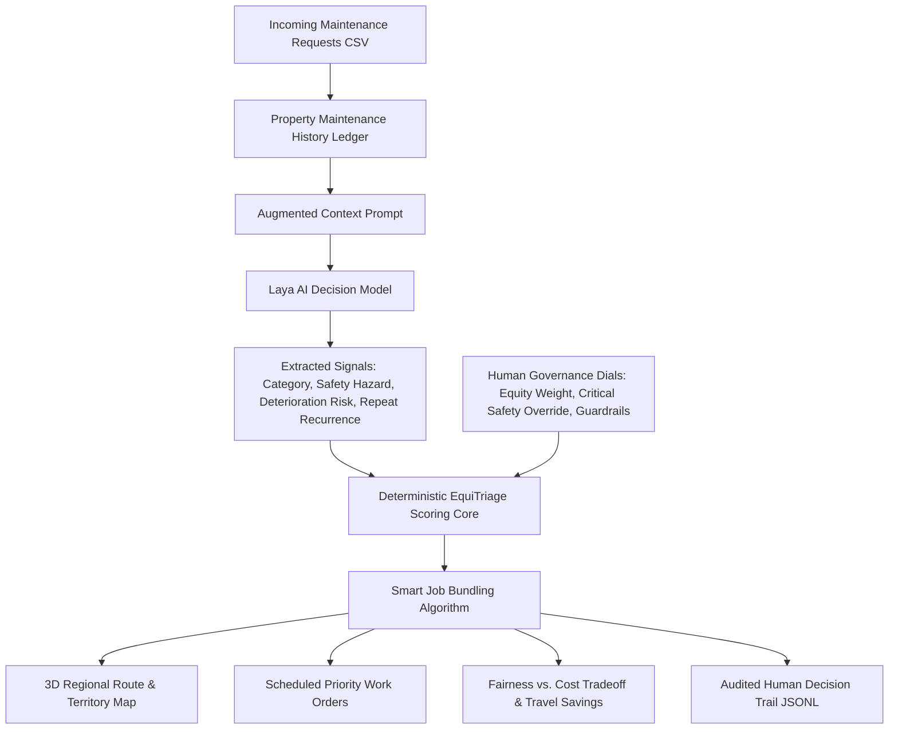

# EquiTriage: Equity-Aware Housing Maintenance Dispatch & Logistics Engine

## Overview

**EquiTriage** is an autonomous decision-support and dispatch engine for public housing maintenance across the Northern Territory (NT). It bridges the gap between a simple "smart prioritization list" and a real-world **spatial logistics engine**, uniting **Laya AI signal extraction**, **context-aware RAG asset history**, **interactive 3D geospatial routing**, and **intelligent trip bundling**.

The system makes equity trade-offs visible, controllable, and mathematically accountable to dispatchers, housing authorities, and public record auditors.

---

## 🚀 Key Features

### 1. 🗺️ Territory Route & Equity Map (Regional Access & Coverage)
Public housing maintenance in the Northern Territory is fundamentally a spatial problem spanning over 1.3 million square kilometers.
- **Side-by-Side Dispatch Corridors**: Compares the standard **Cheapest-Trip-First** route (which hovers strictly within 15 km of the Darwin urban core) against the **EquiTriage** route (which pushes out to remote communities like Wadeye, Katherine, and Tennant Creek).
- **Wait-Time Node Telemetry**: Every community request is plotted as a 3D glowing geospatial node, color-coded by waiting duration:
  - 🟢 **Mint Green**: Fresh requests (<14 days)
  - 🟠 **Amber**: Ageing requests (14–45 days)
  - 🔴 **Glowing Crimson**: Breached SLA guardrails (>45 days)
- **3D Flight & Travel Corridors**: Visualizes fleet paths connecting the Darwin Fleet Depot directly to community work sites.
- **Regional Coverage Reach**: Quantifies maximum contractor outreach in kilometers and tracks remote community service rates.

### 2. 📦 Smart Job Bundling (Same-Trip Fuel & Cost Savings)
Remote dispatch is expensive: driving a crew 420 km to Wadeye or 988 km to Tennant Creek burns substantial fuel and technician hours.
- **Active Manifest Aggregation**: When EquiTriage schedules a remote trip for an urgent Tier 0 or high-equity job, the engine dynamically scans the queue and bundles all pending low-priority (Tier 2) or overdue repairs in that same community onto the vehicle manifest.
- **Marginal Travel Cost = 0 km**: Because the crew and vehicle are already on site, resolving secondary jobs incurs zero additional round-trip travel.
- **Mathematical Cost Recovery**:
  $$\text{Travel Saved (km)} = \sum_{j \in \text{bundled}} 2 \times \text{Distance}(j)$$
  $$\text{Fleet Budget Recovered (\$)} = \text{Travel Saved} \times \$1.50/\text{km}$$
- **The Equity Flex**: Proves mathematically that by bundling overdue lower-priority tasks with emergency runs, the equity model recovers thousands of kilometers of avoided future travel, making fairness far cheaper than expected.

### 3. 🔍 Repeat Repair Detection (Property Maintenance History)
Instead of evaluating work orders in isolation, EquiTriage equips Laya with address-level historical context.
- **Address & Asset History Ledger**: Groups work orders by property (`property_id` or community lot address) and retrieves the last 3 maintenance requests.
- **History Prompt Augmentation**: Feeds historical repair records directly into the Laya model prompt:
  > *"Context: Plumber snaked main sewer inspection riser 18 days ago. Current request: Toilet overflowing into shower recess."*
- **Preventative Deterioration Multiplier**: Laya evaluates the typed question `chronic_failure`. When recurring asset failure is identified, a multiplier boosts deterioration urgency:
  $$\text{Urgency Boost} = 1 + \left(\frac{\text{Chronic Prob} - \text{Floor}}{1 - \text{Floor}}\right) \times \text{Weight}$$
  Shifts dispatch operations from purely reactive repairs to predictive asset preservation.

### 4. 🌪️ Extreme Weather Surge Simulation (Monsoon & Cyclone Stress Test)
Demonstrates system resilience under real-world Northern Territory weather extremes.
- **Dynamic Incident Injection**: Sidebar slider allows dispatchers to simulate a Severe Tropical Cyclone or monsoonal surge by injecting up to 50 realistic structural and water damage tickets across the Top End (Darwin, Palmerston, Casuarina, Katherine, Daly River).
- **Stress-Test Resilience**: Live visualization demonstrates how standard cheapest-trip algorithms abandon remote communities when urban centers are flooded with local storm requests, while EquiTriage's hard safety floors and wait-time guardrails keep critical remote lifelines protected.

---

## 🏛️ System Architecture



---

## 📊 Deterministic Scoring & Policy Formulation

1. **Base Urgency**:
   $$\text{Base Urgency} = (\text{Safety Prob} \times 6.0) + (\text{Effective Deterioration} \times 1.33)$$
2. **Equity Adjustments**:
   - $\text{Wait Multiplier} = 1 + \min(1.0, \text{Days Waiting} \times 0.02)$
   - $\text{Remote Multiplier} = 1 + \left(\frac{\text{Distance}}{100}\right) \times 0.10 \times \text{Equity Weight}$
   - $\text{Travel Discount} = \left(1 + \frac{0.25 \times \text{Distance}}{100}\right)^{1 - \text{Equity Weight}}$
3. **Final Policy Score**:
   $$\text{Final Score} = \frac{\text{Base Urgency} \times \text{Wait Multiplier} \times \text{Remote Multiplier}}{\text{Travel Discount}}$$
4. **Hard Safety & Guardrail Tiers**:
   - **Tier 0 (Critical Safety Override)**: $\text{Safety Prob} \ge \text{Safety Floor}$ (always dispatched first; distance cannot delay)
   - **Tier 1 (Ageing Guardrail)**: $\text{Days Waiting} > \text{Max Wait Days}$ and $\text{Urgency} \ge 2.0$
   - **Tier 2 (Scored Priority)**: Normal priority scoring

---

## 💻 Running the Application

### 1. Interactive Web Dashboard (Recommended)
```bash
streamlit run app.py
```
Open [http://localhost:8501](http://localhost:8501) in your browser.
- Select your dataset from the sidebar (`NT Housing Territory Operations (26 Tickets)`, `New Inflow`, etc.).
- Click `[ RUN LIVE LAYA TRIAGE ]` to trigger Laya signal extraction and property history retrieval.
- Explore the **Route & Dispatch Map**, **Priority Work Orders**, **Fairness vs. Cost Tradeoff**, and test the **Extreme Weather Stress Test**.

### 2. Command-Line Interface
```bash
python main.py
```
Executes the full pipeline, printing the top dispatch queue, trip bundling manifest, and trade-off metrics.

---

## 📁 Repository Structure

```
Laya/
├── app.py                      # Streamlit interactive web console (Pydeck 3D & Folium mapping)
├── equitriage_engine.py        # Core logic: Laya AI extraction, RAG history lookup, scoring & bundling
├── geo_utils.py                # Geospatial NT coordinates, Pydeck 3D arcs & Folium map builder
├── main.py                     # CLI demonstration script
├── generate_cyclone_catalog.py # Script to generate authentic NT cyclone damage tickets
├── cache_cyclone_signals.py    # Script to pre-cache Laya signals for cyclone tickets
│
└── data/                       # 📂 Dedicated Data Directory
    ├── nt_housing_operations.csv      # Primary operations dataset (26 authentic NT requests)
    ├── historical_maintenance.json    # Property maintenance ledger for context-aware RAG
    ├── cyclone_incident_catalog.csv   # 50 authentic NT cyclone emergency damage tickets
    ├── cyclone_signals_cache.json     # Pre-cached Laya extractions for 0ms slider response
    ├── newdata.csv                    # Intake batch (12 tickets)
    ├── maintenance_tickets.csv        # Baseline minimal demo dataset (4 tickets)
    └── maintenance_tickets_large.csv  # Historical territory archive (500 tickets)
```
