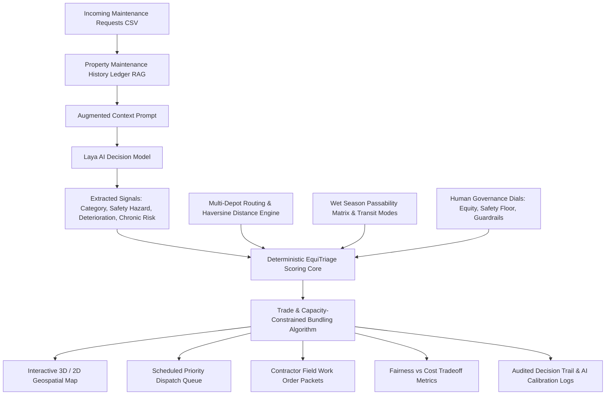

# EquiTriage: Equity-Aware Housing Maintenance Dispatch & Logistics Engine

## Overview

**EquiTriage** is an autonomous decision-support and dispatch engine for public housing maintenance across the Northern Territory (NT). It bridges the gap between a simple "smart prioritization list" and a real-world **spatial logistics engine**, uniting:
- **Laya AI signal extraction** (typed zero-shot classification & hazard detection)
- **Context-aware RAG asset history** (detecting recurring failures and chronic property breakdown)
- **Multi-depot regional fleet routing** (Darwin, Katherine, Tennant Creek, Alice Springs, Nhulunbuy)
- **Wet-season road passability matrix** (simulating seasonal river cuts and barge/air logistics)
- **Trade-constrained smart trip bundling** (plumber, electrician, carpenter, pest control matching)
- **Field contractor work packet generation** (printable offline run sheets with safety briefings)
- **Enterprise REST API microservice** (FastAPI) and **comprehensive automated test suite** (pytest)

The system makes equity trade-offs visible, controllable, and mathematically accountable to dispatchers, housing authorities, and public record auditors.

---

## 🚀 Key Features

### 1. 🏢 Multi-Depot Hub-and-Spoke Logistics
Maintenance across the NT spans over 1.3 million square kilometers and is staged from regional operations hubs:
- **Darwin Central Fleet Depot** (Top End, Tiwi Islands)
- **Katherine Regional Depot** (Big Rivers region: Katherine, Daly River, Pine Creek, Borroloola)
- **Barkly Regional Depot** (Tennant Creek)
- **Alice Springs Fleet Depot** (Central Australia: Alice Springs, Yuendumu, Papunya, Kintore, Hermannsburg)
- **East Arnhem Logistics Hub** (Nhulunbuy, Yirrkala, Groote Eylandt)
- **Dynamic Routing**: Automatic nearest-depot assignment or coordinator-selected staging hub.

### 2. 🌧️ Wet Season Road Passability & Access Matrix
Models Northern Territory wet season monsoonal reality:
- **River Crossings & Inundation**: Monitors vulnerable river crossings (Cahills Crossing into Gunbalanya, Daly River causeway into Nauiyu, Roper Highway into Ngukurr).
- **Dynamic Transit Modes**: Automatically switches transit mode to **4WD Heavy Convoy**, **Coastal Barge**, or **Light Aircraft Charter** when road links are cut.
- **Access Factor**: Adjusts logistical complexity and fleet cost multipliers.

### 3. 🔧 Trade-Constrained Smart Trip Bundling & Shift Capacity
Remote dispatch requires the right skills and realistic shift budgets:
- **Trade Skill Matching**: Identifies trade requirements (`Plumber`, `Electrician`, `Carpenter / Builder`, `Pest Specialist`, `General Maintenance`). When an emergency Plumber is dispatched to Wadeye, the vehicle manifest only bundles compatible repairs, preventing trade mismatches.
- **Labor Shift Ceiling**: Tracks estimated on-site labor hours against a working shift limit (e.g. 12 hours) to avoid overloading remote contractor crews.
- **Avoided Travel Recovery**: Proves mathematically that bundling compatible jobs at 0 km marginal travel recovers thousands of kilometers in fleet costs:
  $$\text{Fleet Budget Recovered (\$)} = \sum_{j \in \text{bundled}} 2 \times \text{Distance}(j) \times \$1.50/\text{km}$$

### 4. 🚜 Printable Field Contractor Work Packets
Generates complete, offline-ready work packets for trade contractors heading out into areas without cellular coverage:
- Destination GPS coordinates & regional depot origin
- Road access briefing, river flood advisories & transit mode
- Itemized work orders with prior maintenance history and tenant notes
- Essential tools and spare parts checklist
- On-site completion sign-off table

### 5. 🛠️ Work Order Resolution & Active Learning Calibration
- **Asset Ledger Update**: Coordinators and technicians can mark jobs resolved, appending parts used and resolution summaries directly to `data/historical_maintenance.json`.
- **AI Calibration Feedback**: Coordinators can calibrate AI categories and safety probabilities with justifications, logging to `data/evaluation_feedback.jsonl` for continuous active learning.

### 6. 🌐 Headless REST API (FastAPI) & Automated Testing (pytest)
- Decoupled REST microservice in `api.py` exposing endpoints for enterprise housing ERPs (SAP, Salesforce, GovCMS).
- Robust unit test suite in `tests/test_equitriage.py` verifying deterministic scoring tiers, trade constraints, labor budgets, wet-season passability, and API routes.

---

## 🏛️ System Architecture



---

## 📊 Deterministic Scoring & Policy Formulation

1. **Base Urgency**:
   $$\text{Base Urgency} = (\text{Safety Prob} \times 6.0) + (\text{Effective Deterioration} \times 1.33)$$
2. **Equity Adjustments**:
   - $\text{Wait Multiplier} = 1 + \min(1.0, \text{Days Waiting} \times 0.02)$
   - $\text{Remote Multiplier} = 1 + \left(\frac{\text{Distance}}{100}\right) \times 0.10 \times \text{Equity Weight}$
   - $\text{Travel Discount} = \left(1 + \frac{0.25 \times \text{Distance}}{100}\right)^{1 - \text{Equity Weight}}$
3. **Final Policy Score**:
   $$\text{Final Score} = \frac{\text{Base Urgency} \times \text{Wait Multiplier} \times \text{Remote Multiplier}}{\text{Travel Discount}}$$
4. **Hard Safety & Guardrail Tiers**:
   - **Tier 0 (Critical Safety Override)**: $\text{Safety Prob} \ge \text{Safety Floor}$ (always dispatched first; distance cannot delay)
   - **Tier 1 (Ageing Guardrail)**: $\text{Days Waiting} > \text{Max Wait Days}$ and $\text{Urgency} \ge 2.0$
   - **Tier 2 (Scored Priority)**: Normal priority scoring

---

## 💻 Running the Application

### 1. Interactive Web Dashboard (Streamlit)
```bash
streamlit run app.py
```
Open [http://localhost:8501](http://localhost:8501) in your browser.
- Toggle between **Closest Regional Depot** and specific regional hubs.
- Test the **Wet Season Monsoon** road flooding switch.
- Adjust **Trade Skill Matching** and **Max Crew Shift Hours**.
- Inspect tickets, mark repairs resolved, or download printable **Field Contractor Work Packets**.

### 2. Command-Line Interface (CLI)
```bash
python main.py
```
Executes the full pipeline, printing the top dispatch manifest with assigned depots, required trades, and bundling recovery.

### 3. REST API Service (FastAPI)
```bash
uvicorn api:app --reload --port 8000
```
- Interactive Swagger documentation: [http://localhost:8000/docs](http://localhost:8000/docs)
- Endpoints:
  - `GET /health`: Health check and depot count
  - `GET /api/depots`: All NT depot hubs and GPS coordinates
  - `GET /api/road-conditions`: Seasonal road passability status
  - `POST /api/triage`: Scores and ranks tickets with deterministic policy
  - `POST /api/manifest`: Generates vehicle manifests and bundling cost savings
  - `POST /api/resolve`: Records completed work order into RAG asset history
  - `POST /api/feedback`: Records coordinator calibration feedback

### 4. Running the Test Suite
```bash
pytest tests/test_equitriage.py -v
```

---

## 📁 Repository Structure

```
Laya/
├── app.py                      # Streamlit interactive web console (Pydeck 3D & Folium mapping)
├── api.py                      # FastAPI REST microservice (Swagger UI, ERP integration)
├── equitriage_engine.py        # Core logic: Laya AI, scoring, trade bundling, work packet generator
├── geo_utils.py                # Multi-depot coordinates, haversine engine, wet season road matrix
├── main.py                     # CLI demonstration script
├── generate_cyclone_catalog.py # Script generating authentic NT cyclone damage tickets
├── cache_cyclone_signals.py    # Script pre-caching Laya signals for cyclone tickets
│
├── tests/
│   └── test_equitriage.py      # Automated pytest unit test suite
│
└── data/                       # 📂 Dedicated Data Directory
    ├── nt_housing_operations.csv      # Primary operations dataset (26 authentic NT requests)
    ├── historical_maintenance.json    # Property maintenance ledger for context-aware RAG
    ├── cyclone_incident_catalog.csv   # 50 authentic NT cyclone emergency damage tickets
    ├── cyclone_signals_cache.json     # Pre-cached Laya extractions for 0ms slider response
    ├── evaluation_feedback.jsonl      # Coordinator calibration feedback for active learning
    ├── audit_log.jsonl                # Immutable human decision audit trail
    ├── newdata.csv                    # Intake batch (12 tickets)
    ├── maintenance_tickets.csv        # Baseline minimal demo dataset (4 tickets)
    └── maintenance_tickets_large.csv  # Historical territory archive (500 tickets)
```
